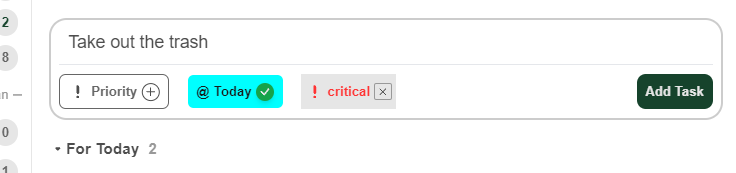
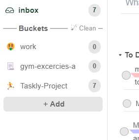
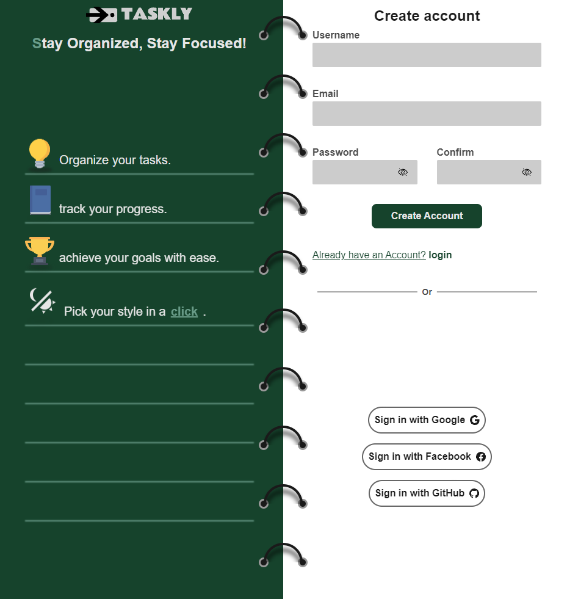
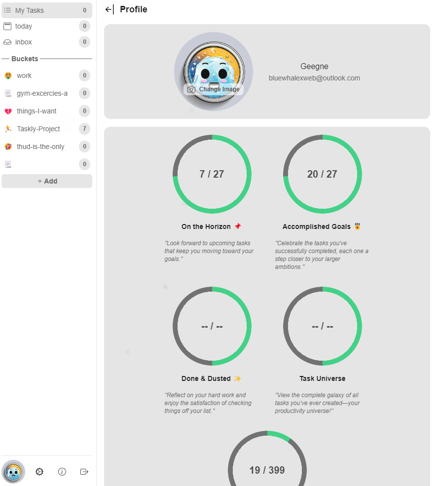

# 🌟 Taskly – Your Ultimate Task Management Solution 📝✨

Taskly is the productivity app designed to help you organize, prioritize, and accomplish your daily tasks effortlessly. Whether you're managing work projects, personal to-dos, or planning events, Taskly has you covered with an intuitive interface and powerful features. 🚀

## 🌟 Key Features:
- **Effortless Task Management**: Create, edit, and organize your tasks in seconds! 📋
- **Custom Categories**: Group tasks by projects or personal categories for seamless organization. 🗂️
- **Prioritization**: Mark important tasks with priority levels to stay focused on what matters most. 🔥
- **Reminders & Notifications**: Never miss a deadline with timely alerts and reminders. ⏰
- **Collaborative Workflows**: Share tasks and collaborate with teammates or family members with ease. 🤝
- **Progress Tracking**: Keep an eye on your productivity with insightful analytics and reports. 📊

## 🚀 Why Choose Taskly?
Taskly is designed for simplicity and functionality. Whether you're a busy professional, student, or team lead, Taskly helps you stay organized and productive with minimal effort. ✨

---

### 💻 **Get Started Today**
Contribute to the code or report issues on [GitHub](https://github.com/your-username/taskly). Let's build a more productive future together! 🙌

---

## 📸 Sneak Peek:









---

**Built with love by Ahmed El Grahbra and contributors** ❤️🛠️

---

Hope you enjoy using Taskly as much as we loved building it! 🌈

---

Feel free to customize the link to the image and GitHub URL as needed. Let me know if you'd like any further tweaks!

This is a [Next.js](https://nextjs.org) project bootstrapped with [`create-next-app`](https://nextjs.org/docs/app/api-reference/cli/create-next-app).

## Getting Started

First, run the development server:

```bash
npm run dev
# or
yarn dev
# or
pnpm dev
# or
bun dev
```

Open [http://localhost:3000](http://localhost:3000) with your browser to see the result.

You can start editing the page by modifying `app/page.tsx`. The page auto-updates as you edit the file.

This project uses [`next/font`](https://nextjs.org/docs/app/building-your-application/optimizing/fonts) to automatically optimize and load [Geist](https://vercel.com/font), a new font family for Vercel.

## Learn More

To learn more about Next.js, take a look at the following resources:

- [Next.js Documentation](https://nextjs.org/docs) - learn about Next.js features and API.
- [Learn Next.js](https://nextjs.org/learn) - an interactive Next.js tutorial.

You can check out [the Next.js GitHub repository](https://github.com/vercel/next.js) - your feedback and contributions are welcome!

## Deploy on Vercel

The easiest way to deploy your Next.js app is to use the [Vercel Platform](https://vercel.com/new?utm_medium=default-template&filter=next.js&utm_source=create-next-app&utm_campaign=create-next-app-readme) from the creators of Next.js.

Check out our [Next.js deployment documentation](https://nextjs.org/docs/app/building-your-application/deploying) for more details.
